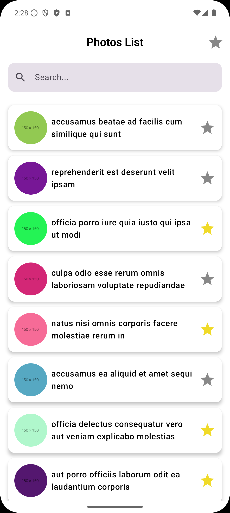
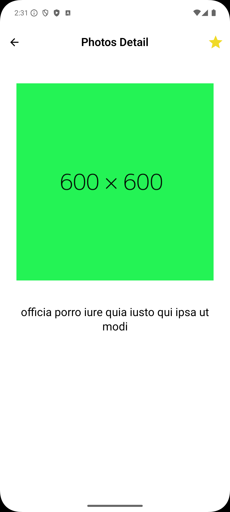
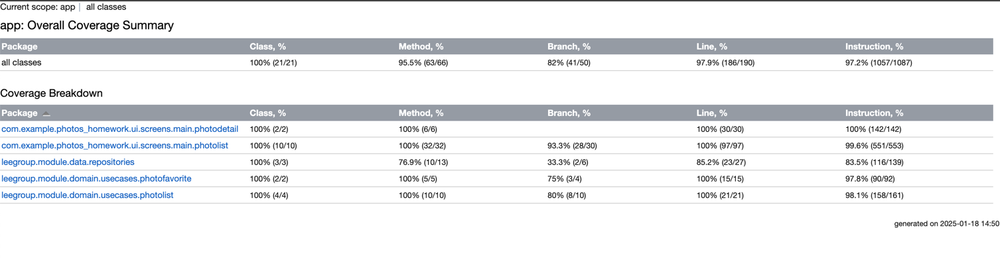

# Photo

## Screenshots

| Photos List                                        | Photos Detail                                        |
|----------------------------------------------------|------------------------------------------------------|
|  |  |

## Testing

- Run unit testing with coverage:

```
$ ./gradlew :app:koverHtmlReport
```

Report is located at: `app/build/reports/kover/`



## Build and deploy

For `release` builds, we need to provide release keystore and signing properties:

- Put the `release.keystore` file at root `config` folder.
- Put keystore signing properties in `signing.properties`
